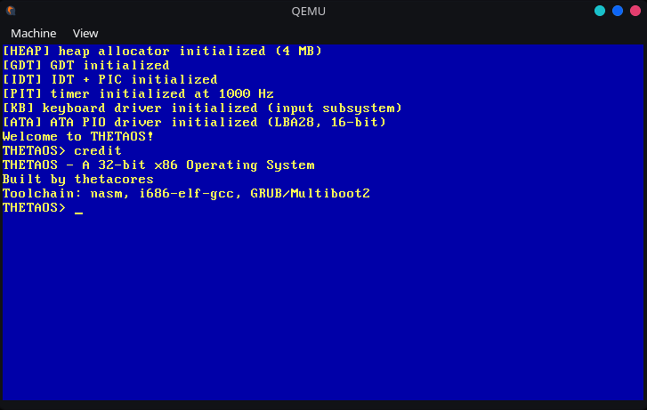

  

   

  

   

  

---

### ⚡ Flagship Project

> A custom operating system kernel built from the ground up in **C** and **x86 Assembly** — bootloader, kernel, the whole stack.

---

### 🛠 Stack

  
  
  
  
  

---

### 📬 Contact

  
  
  

